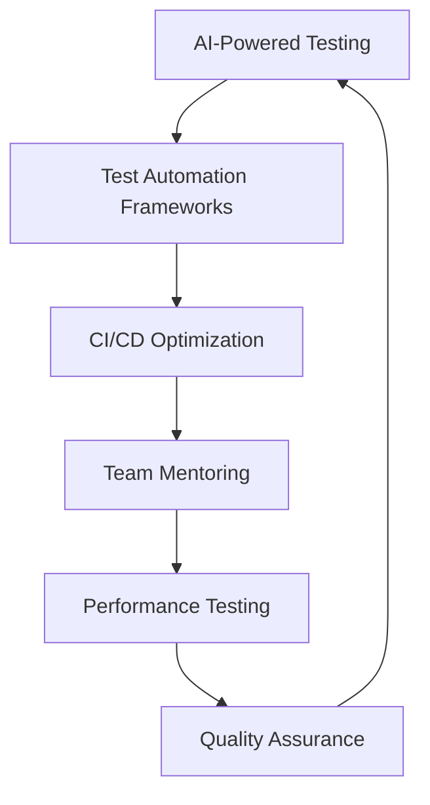

# 👋 Hi, I'm Yunus Emre Yıldız

<div align="center">
  
  
  
  
  
  *Building the future of software testing with AI-powered automation*

</div>

---

## 🚀 About Me

```yaml
name: Yunus Emre Yıldız
title: Senior QA & Test Automation Engineer
location: Istanbul, Turkey
experience: 4+ years
passion: AI-Powered Testing Solutions
current_role: Senior QA Engineer @ PttAVM
```

**Results-driven QA Engineer** specializing in **AI-powered test automation** and **framework development**. I've reduced testing cycles by **60%** and improved bug detection rates across **e-commerce**, **retail**, and **travel** industries.

### 🎯 What I Do Best
- 🧠 **AI-Powered Testing** - Implementing ML algorithms for intelligent test case generation
- 🏗️ **Framework Architecture** - Building robust automation frameworks from scratch
- 📱 **Mobile & Web Testing** - Expert in Selenium, Appium, and cross-platform testing
- ⚡ **CI/CD Integration** - Optimizing testing pipelines for faster releases
- 👥 **Team Leadership** - Mentoring junior engineers and driving automation strategies

---

## 🛠️ Tech Stack

### **Automation & Testing**


### **Programming Languages**


### **Tools & Technologies**


---

## 🏆 Key Achievements

<table>
<tr>
<td width="50%">

### 🧠 AI-Powered Framework
- **45%** reduction in critical bug escape rate
- ML-based test prioritization system
- Intelligent test data generation

</td>
<td width="50%">

### 📱 Mobile Automation Suite
- **90%** code coverage for critical user journeys
- iOS & Android platform support
- Comprehensive testing framework

</td>
</tr>
<tr>
<td width="50%">

### ⚡ Performance Optimization
- **35%** improvement in application response time
- Automated performance monitoring
- Bottleneck identification & resolution

</td>
<td width="50%">

### 🚀 CI/CD Integration
- **65%** reduction in regression testing time
- **20+ hours** weekly time savings
- **99.9%** uptime for critical features

</td>
</tr>
</table>

---

## 🎯 Current Focus



---

## 🏢 Professional Experience

### 🎯 **Senior QA Engineer** @ **PttAVM** *(July 2025 - Present)*
- 🏗️ Architected end-to-end test automation framework from scratch
- 🤖 Developed AI-powered testing tools improving coverage by **40%**
- 📈 Serving platform with **1M+ daily users**

### ✈️ **Senior QA Engineer** @ **Enuygun** *(May 2024 - July 2025)*
- 📱 Designed mobile test automation suite achieving **85%** coverage
- ⚡ Reduced release cycle from **5 days to 2 days**
- 🔍 Identified **30+ critical production issues**
- - 👥 Mentored team of **2 junior QA engineers**

### 🛍️ **Senior Test Automation Engineer** @ **DeFacto Technology** *(June 2022 - May 2024)*
- 🏪 Led automation for Turkey's leading retail company (**500+ stores**)
- 🔄 Developed hybrid framework reducing regression time by **65%**
- 🛠️ Built custom testing tools saving **20+ hours weekly**
- - 👥 Mentored team of **5 junior QA engineers**

---

## 🎓 Education & Certifications

- 🎓 **Bachelor of Science in Software Engineering** - Dogus University *(2021)*
- 🏆 **Internet of Things (IoT)** - Opthema Certified
- 📚 **ISTQB Foundation Level** *(In Progress)*

---

## 🌟 Featured Projects

### 🚁 **DroneMobil** - *Teknofest 2021 Finalist*
```
🏆 Achieved finalist position among 500+ competing teams
🔧 Developed control software for symbiotic aerial/ground vehicle
```

### 🅿️ **ParkSlots** - *iOS Application*
```
📍 Location-based parking finder for Istanbul
🔄 Real-time availability updates
```

### 🌾 **FarmMobile** - *Full-Stack Application*
```
🌱 Agricultural management system
📡 IoT sensor integration for real-time crop monitoring
```

---

## 🤝 Let's Connect!

<div align="center">
  
  [](https://linkedin.com/in/yunusemreyildiz)
  [](mailto:yunusemreyildiz@mail.ru)
  [](https://github.com/yunusemreyildiz)
  
</div>

---

<div align="center">
  
  
  
  *"Quality is not an act, it is a habit." - Aristotle*
  
</div>
